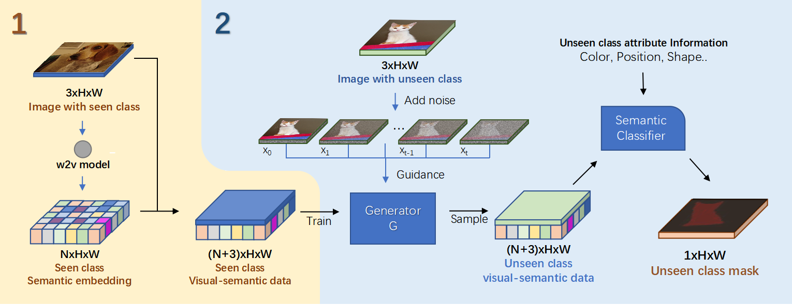
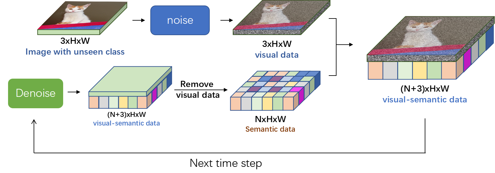
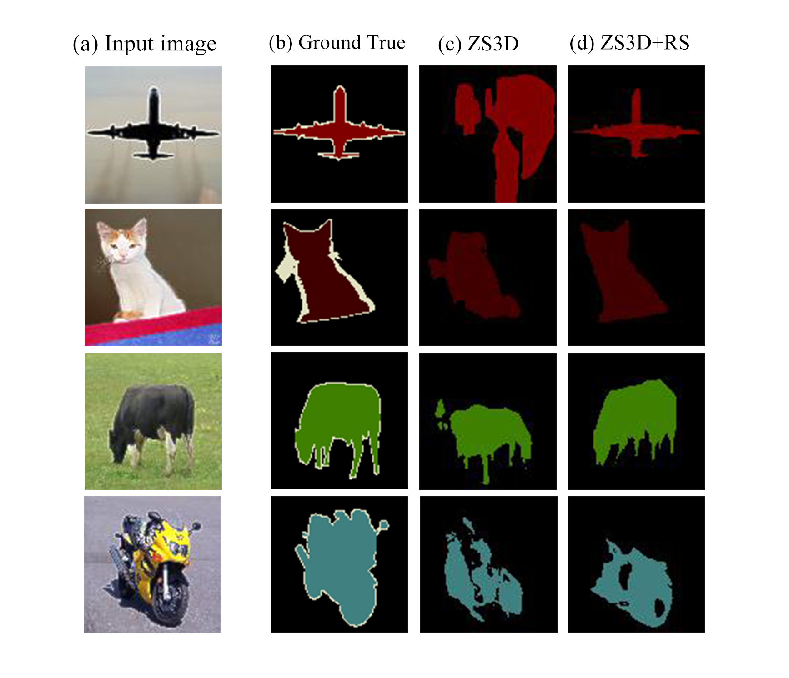
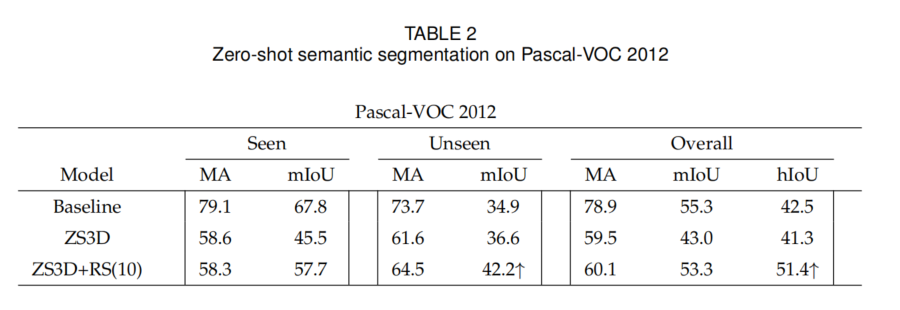
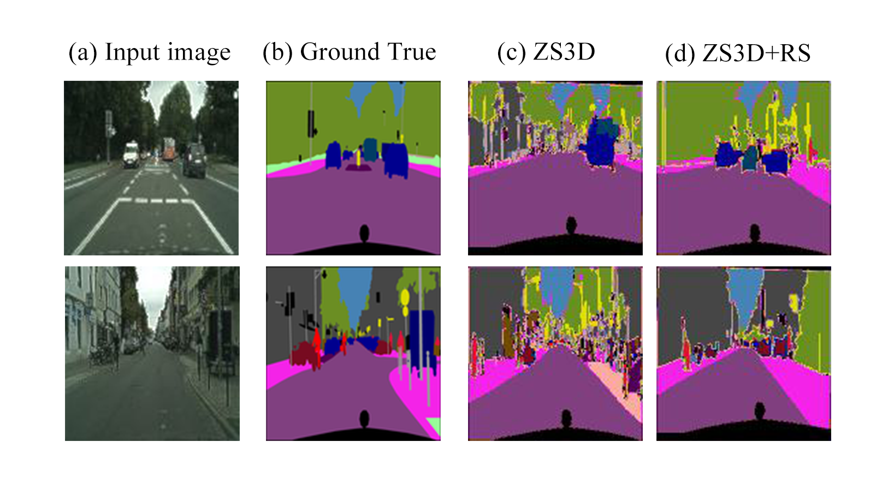
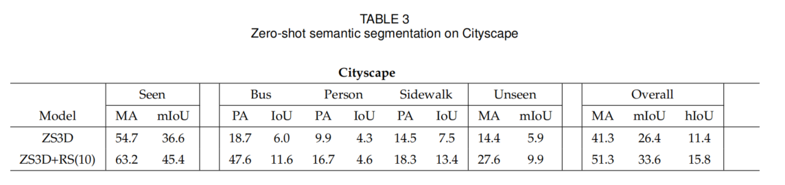
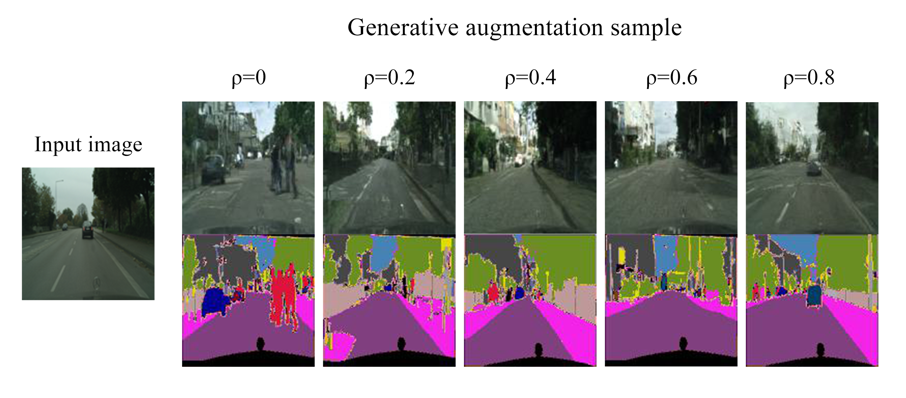

# Zero-Shot-Semantic-Segmentation-using-Diffusion-model
[download](https://1drv.ms/b/s!AlAOIOBwskGHwUvkLENBiBq70gd4?e=hhMEoB)

## Abstract
Our method uniquely uses diffusion models for visual-semantic data generation in unseen classes, bypassing pre-trained backbones. It directly produces segmentation masks with a basic semantic classifier and can enhance data for semantic segmentation datasets.

## Our main contributions are as follows:
1) We introduce diffusion models into the zero-shot
semantic segmentation domain for the first time,
realizing the synthesis of visual-semantic feature
data for unseen classes.
2) Our approach achieves approaching state-of-the-art
segmentation performance using a streamlined
architecture without relying on a pre-trained
backbone.
3) Based on the original architecture, we propose a
novel and efficient data augmentation method for
semantic segmentation dataset.

## METHODOLOGY

Our proposed method shown in the Figure, does not rely on
pre-trained backbones. we stack seen class visual information with their pixel-level semantic expressions as training
data and train a DDPM model to generate corresponding
visual-semantic data. During the sampling process, we use
images with unseen classes as the condition, guiding the
trained generator to generate matching semantic embedding
data. Subsequently, we constructed a semantic classifier to
achieve pixel-level classification of unseen and seen class
objects within the image realizing semantic segmentation.
The above technical details were elaborated in the following
subsections

###  Zero-shot Semantic Segmentation

In the preceding sections, we have provided a detailed
description of the functions of each component within the
ZS3D architecture. Next, we will describe the principles behind employing this architecture for zero-shot semantic segmentation. Our method entails using images as conditions
to guide the generator in producing visual-semantic data.
These data are then mapped to labels representing various
classes by the semantic classifier. The sampling process of
the generator consists of T denoising steps, corresponding
to the gradual transformation process of noise into feature
data. To effectively guide the sample generation process
with the input image, it is crucial to introduce guiding
information at each step of the sampling.
The guidance process is shown in the Figure. First, we
employ the forward part of the model to produce a set of T
images with the different levels of noise. At every step of the
sampling process, we replace the visual layer in each denoising result with the add-noise image xt. Subsequently, the
sampler generates the denoising visual-semantic data for
the next time step based on the modified samples. In this iterative process, the visual layer in each generated sample is
replaced by guiding information, and the sampler proceeds
to the next step of sampling based on the modified visualsemantic data. This process directs the sampler to synthesize
semantic embeddings in the corresponding semantic layer,
based on the data features of the pixel points in the visual
layer. When unseen classes are present in the guiding image, the sampler synthesizes a blurred embedding for the
unseen class in the guiding image, corresponding to the
semantically closest seen class. This is the key to achieve
segmentation for unseen classes. After T steps of denoising,
we obtain the pixel-level semantic representation of the input image. We then use a semantic classifier which adjusted
with additional semantic information, to map the semantic
embeddings to mask space, ultimately obtaining the input
image’s mask and achieving semantic segmentation for both
seen and unseen classes.

###  Qualitative results on Pascal-VOC 2012

###  Qualitative results on Cityscape

### Data Augmentation on Cityscape

